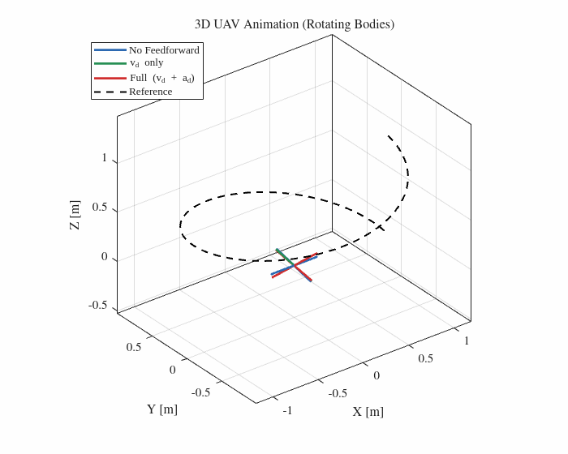
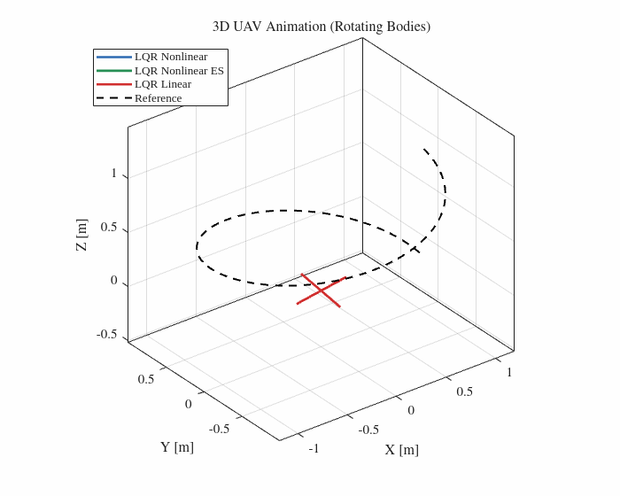
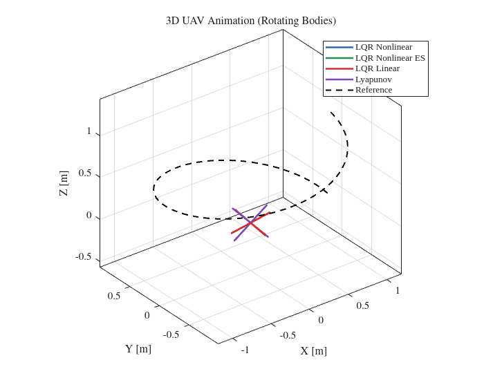

# Project UAVs - Report 2: Crazyflie Motion Control and Planning

> **Course project** for Unmanned Aerial Vehicles 2025/2026.  
> Group 6

---

## Table of Contents

1. [Project Overview](#project-overview)
2. [Repository Structure](#repository-structure)
3. [Part 1 - Linear Control (LQR)](#part-1--linear-control-lqr)
4. [Part 2 - Nonlinear Control (Lyapunov)](#part-2--nonlinear-control-lyapunov)
   - [Performance Results](#performance-results)
5. [Part 3 - ICUAS-Inspired Planning](#part-3--icuas-inspired-planning)
   - [Competition Scenario](#competition-scenario)
   - [Planning Algorithm](#planning-algorithm)
   - [Option A: 5 Free Relay Drones](#option-a-5-free-relay-drones)
   - [Option B: Shadow Drone + 4 Free Relays](#option-b-shadow-drone--4-free-relays)
   - [What Changes Between Options](#what-changes-between-options)
   - [How the Animation Works](#how-the-animation-works)
   - [ROS 2 / Gazebo Deployment](#ros-2--gazebo-deployment)
6. [Running the Code](#running-the-code)
7. [Videos](#videos)
8. [Report](#report)

---

## Project Overview

The project is divided into three independent parts:

| Part | Topic | Language |
|---|---|---|
| 1 | Linear Control - LQR (absolute state, nonlinear plant, error-space) | MATLAB |
| 2 | Nonlinear Control - Lyapunov stability-based controller | MATLAB |
| 3 | Motion planning and animation inspired by ICUAS 2026 competition scenario | Python |

Parts 1 and 2 are MATLAB simulations of a Crazyflie 2.1 (mass 29 g) tracking a spiral trajectory. **Part 3 is entirely separate**: it is a Python planning and animation exercise inspired by the ICUAS 2026 UAV Competition scenario, where drones must maintain a communication relay chain to a moving ground rover in an urban environment. The team did not participate in the competition - this is a course exercise.

---

## Repository Structure

```
Project-UAVs-23-code/
│
│  ── Parts 1 & 2: MATLAB ──────────────────────────────────────────────────────
│
└── matlab/
    ├── init.m                         # Parameters, trajectory, gains
    ├── class_1_4_LQR_Design.m        # Part 1 - LQR simulation (3 variants)
    ├── class_2_Lyapunov_Design.m     # Part 2 - Lyapunov simulation
    │
    ├── src/                           # Helper functions (added to MATLAB path by scripts)
    │   ├── animateUAV.m              # 3D animation playback
    │   ├── plotResults.m             # Plots + RMSE/ISE/ITAE metrics
    │   ├── lyapunovCtrl.m            # Lyapunov control law
    │   ├── simulate_lqr.m            # Single LQR simulation run
    │   ├── quad_dynamics_linear.m    # Linearized quadrotor ODE
    │   └── quad_dynamics_nonlinear.m # Full nonlinear quadrotor ODE
    │
    └── figures/                       # Generated by MATLAB (*.png gitignored, GIFs tracked)
        ├── lqr/feedforward/          # Feedforward effect
        ├── lqr/full/                 # LQR variant comparison
        ├── lqr/tuning/               # Q/R tuning study
        └── lyapunov/                 # Lyapunov vs LQR
│
│  ── Part 3: Python (animation + planning) ────────────────────────────────────
│
└── competition/
    ├── main.py                        # Option A - 5 free relay drones (animation)
    ├── main_sombra.py                 # Option B - shadow drone + 4 free relays (animation)
    ├── planeador.py                   # Planning core: union search, Hungarian, Gauss-Seidel projection
    ├── mapa.py                        # Map builder: STL → pillars → visibility graph → lazy/sticky corridor
    ├── render.py                      # Shared Matplotlib/FFmpeg renderer (both options)
    ├── mapaperf.py                    # Static 2D map figure (obstacles, route, ArUco markers, landing pads)
    ├── icuas26_1.stl                  # City world geometry (from ICUAS 2026 repo)
    │
    └── ros2/                          # ROS 2 / Crazyswarm2 deployment (Gazebo)
        ├── exportar_trajetoria.py        # Export Option B plan → trajetoria_relay.npz
        ├── exportar_trajetoria_5relay.py # Export Option A plan → trajetoria_relay_5.npz
        └── relay_chain_node.py           # ROS 2 node: replays the plan on Crazyswarm2
```

`mapa_cache.pkl` is generated on the first Python run and reused afterwards.

---

## Part 1 - Linear Control (LQR)

**Entry point:** `class_1_4_LQR_Design.m`

Three LQR variants are compared on the same spiral trajectory. A desired velocity and acceleration feedforward term is added to eliminate tracking delay:

| Variant | Plant | Control Law |
|---|---|---|
| Linear LQR | Linearized dynamics | $u = -K_{\text{lin}} (x - x_d) + a_{\text{desired}}$ |
| Nonlinear LQR | Full nonlinear dynamics | Same gain $K_{\text{lin}}$ on nonlinear plant |
| Error-Space LQR | Linearized dynamics | $u = -K_{\text{ES}} \tilde{x} + a_{\text{desired}}$, where $\tilde{x} = x - \bar{x}$ |

All use forward Euler integration. The shared spiral reference (1 m radius, 2 revolutions, 10 s, +0.1 m/s ascent) and all gains are configured in `init.m`.

### Animation

<p align="center">
  
</p>

*Feedforward effect: No FF (blue), $v_d$ only (green), full $v_d+a_d$ (red).*

<p align="center">
  
</p>

*LQR variants: Nonlinear (blue), Nonlinear ES (green), Linear (red).*

---

## Part 2 - Nonlinear Control (Lyapunov)

**Entry point:** `class_2_Lyapunov_Design.m`

A Lyapunov controller is derived from the candidate (using absolute position p and velocity v; where Kp, Kv are symmetric positive definite matrices):

$$V = \frac{1}{2} (p^T K_p p + v^T v)$$

The implemented control law uses a feedback formulation to drive the states to the equilibrium:

$$u_a = -K_p p - K_v v$$

Along the closed loop the cross terms cancel, leaving

$$\dot{V} = -v^T (d I + K_v) v \le 0$$

so by **LaSalle's Invariance Principle** the state converges to zero: the equilibrium $(p,v)=(0,0)$ is **asymptotically stable** (locally, under the ±40° pitch/roll saturation used in simulation).

### Animation

<p align="center">
  
</p>

*All four tuned controllers: LQR Nonlinear (blue), LQR Nonlinear ES (green), LQR Linear (red), Lyapunov (purple).*

### Performance Results

Quantitative comparison with tuned gains (RMSE/ISE/ITAE over the full 10 s spiral):

| Controller | RMSE [m] | ISE [m²·s] | ITAE [m·s²] | Peak [m] |
|---|---|---|---|---|
| LQR Nonlinear | 0.3691 | 1.3563 | 2.4503 | 1.1852 |
| LQR Nonlinear ES | 0.3691 | 1.3563 | 2.4503 | 1.1852 |
| LQR Linear | 0.3661 | 1.3342 | 2.2102 | 1.1852 |
| **Lyapunov** | **0.3314** | **1.0923** | **1.5592** | **1.1852** |

The Lyapunov controller achieves the lowest RMSE, ISE, and ITAE of all designs. The identical peak error across all controllers reflects the same initial conditions. The error-space and nonlinear LQR formulations are numerically equivalent for this trajectory.

---

## Part 3 - ICUAS-Inspired Planning

> **This section is entirely independent from Parts 1 and 2.** All code here is Python. The animation, the planning algorithm, the renderer, and the map files all belong to this part.

### Competition Scenario

The [ICUAS 2026 UAV Competition](https://github.com/larics/icuas26_competition) poses the following problem:

- A ground rover navigates an **urban obstacle field**
- A team of **Crazyflie drones** must maintain an unbroken **relay chain** from a fixed base station to the rover
- No direct base-to-rover link is allowed - the chain must pass through intermediate UAVs
- Evaluation: connectivity uptime, CBRNe threat identification, mission time

For this project the scenario is simplified: the rover path is fully known in advance, and the focus is exclusively on the **relay planning and animation** problem.

---

### Planning Algorithm

**Files:** `mapa.py`, `planeador.py`

**1. Map construction (`mapa.py`)**  
The city's 3D mesh (`icuas26_1.stl`) is sliced at z = 1 m to extract obstacle pillar footprints. Pillars are clustered, then navigation nodes are generated on a ring around each pillar at a 0.40 m clearance margin from the surface. A visibility graph connects two nodes whenever the segment between them keeps that same 0.40 m margin from every pillar.

**2. Relay corridor - lazy and sticky Dijkstra (`mapa.py → corredor_lazy`, `dijkstra_sticky`)**  
For each frame the relay corridor is the shortest base→rover node chain. Two rules keep it stable instead of flickering between near-equal paths:

- **Lazy** - the previous corridor is reused for as long as it still works, i.e. every link in it stays clear *and* its deepest node still reaches the rover by radio. Dijkstra runs only when one of those fails. Because the rover moves a few cm per frame, this is rare: **49 replans over 2582 frames**.
- **Sticky** - on a replan, `dijkstra_sticky` multiplies the weight of every edge that leaves the old corridor by `PEN = 1.4`, while on-corridor edges keep their true length. The new corridor stays close to the old one and only deviates where the geometry forces a genuinely shorter route.

**3. Drone assignment (`planeador.py → planear` / `planear_sombra`)**  
A union-search over a lookahead window (`L = 300` frames for Option A, `500` for Option B) selects target nodes covering the corridor now and in the near future (bracketing for upcoming turns). The Hungarian algorithm assigns drones to targets. An iterative Gauss-Seidel projection then enforces minimum separation (≥ 0.5 m) and obstacle clearance, while capping movement at `STEP = 0.1 m/frame` (v_max = 1.5 m/s).

---

### Option A: 5 Free Relay Drones

**File:** `main.py`

All **5 drones** are free agents. Each frame the planner places them along the relay corridor to span the full base-to-rover chain. No drone has a fixed role - the Hungarian assignment redistributes them every frame as needed.

```
Base ──[UAV 1]──[UAV 2]──[UAV 3]──[UAV 4]──[UAV 5]── Rover
```

The rover is the terminal node of the communication graph. If any link in the chain breaks, the relay is lost and the mission clock stops.

**Outputs:** `drone_relay.mp4` (4K UHD, 60 fps, ~40 s), `drone_relay_t22s.png`

---

### Option B: Shadow Drone + 4 Free Relays

**File:** `main_sombra.py`

One **shadow drone** is locked directly above the rover at all times - it tracks the rover's position exactly (rover speed 0.5 m/s << v_max 1.5 m/s). The remaining **4 relay drones** only need to connect the base to the shadow, whose position is always known.

```
Base ── [UAV 1]──[UAV 2]──[UAV 3]──[UAV 4]──[Shadow]
                                                ↕
                                              Rover
```

The shadow guarantees rover connectivity without planning. The 4 relays run the same union-search corridor algorithm, but the target is the shadow (not the rover directly). The shadow position is also passed to the Gauss-Seidel projection as a fixed point, so the relays stay ≥ 0.5 m from it as well.

**Outputs:** `drone_relay_sombra.mp4` (4K UHD, 60 fps, ~40 s), `drone_relay_sombra_t22s.png`

---

### What Changes Between Options

| Aspect | Option A - 5 Free Relays | Option B - Shadow + 4 Relays |
|---|---|---|
| **Rover connection** | Planned: one relay must keep LOS to rover | Guaranteed: shadow is always above rover |
| **Active drones** | 5, equal roles | 4 free + 1 shadow (distinct roles, distinct colors) |
| **Planning scope** | Full base → rover corridor | Reduced base → shadow corridor |
| **Lookahead `L`** | 300 frames | 500 frames |
| **Single point of failure** | None (any relay can bridge to rover) | Shadow drone (if lost, rover link breaks) |
| **Max relay speed** | 1.5 m/s | Shadow: 0.5 m/s (rover-locked); relays: 1.5 m/s |
| **Disconnections** | 0 (validated) | 0 (validated) |

---

### How the Animation Works

Both animations are produced by the shared renderer **`render.py`**, using **Matplotlib `FuncAnimation`** rendered offline and exported via FFmpeg. The `shadow_mode` flag is the only difference between the two; it changes the markers and the corridor target, not the resolution.

**Step 1 - Offline simulation**  
Before any rendering, `planear` / `planear_sombra` (in `planeador.py`) computes the full trajectory of every drone across all frames at 15 fps physics. This produces:
- `FD[t]` - list of drone positions at frame `t`
- `FR[t]` - communication graph: nodes, active edges, connected/broken flag

**Step 2 - Frame subsampling**  
The render selects every `stride`-th physics frame so the video duration matches the target (~40 s at 60 fps output).

**Step 3 - Per-frame update**  
Each rendered frame updates:
- **Relay links** - a dark-blue poly-line drawn between connected nodes. The connectivity state is reported by the status badge (`● LINK ACTIVE` in blue / `✖ LINK BROKEN` in red)
- **Drone markers** - a custom top-view quadrotor shape (body disc + 4 arms + 4 rotor discs in an X layout, at 45°, 135°, 225°, 315°) for relay drones; the **same quadrotor shape in purple** for the shadow drone in Option B
- **Rover marker** - rectangular body + 4 wheel circles, rotated to match the rover's instantaneous heading
- **Status overlays** - live simulation time, the `● LINK ACTIVE / ✖ LINK BROKEN` badge, and the count of UAVs currently linked to the rover
- **Right panel** - legend and simulation info (frame, time, relay status)

Both options render at **4K UHD** (3840×2160, 200 DPI) through `render.py`.

---

### ROS 2 / Gazebo Deployment

**Folder:** `competition/ros2/`

The offline plan can be replayed on the ROS 2 / Crazyswarm2 stack (Gazebo). The pipeline has two steps:

1. **Export** the validated plan to a `.npz` file (positions, rover route, arc lengths, altitudes, limits):
   - `exportar_trajetoria.py` → `trajetoria_relay.npz` (Option B: 4 relays + shadow)
   - `exportar_trajetoria_5relay.py` → `trajetoria_relay_5.npz` (Option A: 5 free relays)
   
   Both apply the EMA smoothing (`suavizar`) so the Gazebo setpoints are smooth, and both assert zero disconnections before writing.

2. **Replay** with `relay_chain_node.py`. Key detail: the relays are indexed by the rover's **arc-progress** along the known route (projection of the live rover pose onto the polyline → arc length → frame), **not** by absolute time. If Gazebo runs the rover faster or slower, the chain stays synchronized. With `modo=sombra` the node also commands the shadow drone to follow the live rover pose in real time; with `modo=livre` all 5 relays follow precomputed setpoints. Setpoints are published as `crazyflie_interfaces/Position` on `/<prefix><i>/cmd_position`.

---

## Running the Code

### Parts 1 & 2 - MATLAB

Requirements: MATLAB R2021a+, Control System Toolbox.

Open MATLAB with `matlab/` as the working directory, then:

```matlab
init                      % parameters and trajectory
class_1_4_LQR_Design      % Part 1: LQR comparison
class_2_Lyapunov_Design   % Part 2: Lyapunov comparison
```

`plotResults` and `animateUAV` are called automatically at the end of each script. Figures are saved to `matlab/figures/`.

---

### Part 3 - Python (animation)

Requirements: Python 3.10+, `numpy`, `matplotlib`, `scipy`, `ffmpeg` (system).

```bash
cd competition/

# Option A - 5 free relay drones
python main.py
# → drone_relay.mp4, drone_relay_t22s.png

# Option B - shadow drone + 4 free relays
python main_sombra.py
# → drone_relay_sombra.mp4, drone_relay_sombra_t22s.png
```

On first run `mapa.py` builds the map from `icuas26_1.stl` and saves a cache (`mapa_cache.pkl`). Subsequent runs load the cache instantly. Delete `mapa_cache.pkl` to force a rebuild from the STL.

---

### Part 3 - ROS 2 / Gazebo (optional)

Requirements: ROS 2 Humble, Crazyswarm2, the ICUAS 2026 Gazebo environment.

```bash
cd competition/ros2/

# 1. export the offline plan (run once)
python exportar_trajetoria.py          # Option B → trajetoria_relay.npz
# python exportar_trajetoria_5relay.py # Option A → trajetoria_relay_5.npz

# 2. replay on Crazyswarm2 (parameters shown with defaults)
ros2 run <your_pkg> relay_chain_node --ros-args \
  -p modo:=sombra \
  -p traj_path:=trajetoria_relay.npz \
  -p rover_odom_topic:=/AGV/pose
```

If `crazyflie_interfaces` is not installed, the node runs in a logging-only mode (it prints setpoints instead of publishing them), which is useful for a dry run.

---

## Videos

### Option A - 5 Free Relay Drones
> 5 Crazyflie drones planning their relay positions across the ICUAS 2026 city map to maintain connectivity from base to rover.

[Python 2D Animation (5 relay drones)](https://github.com/user-attachments/assets/9959c9e4-abb2-4fd3-8a33-7f2756ada750)

---

### Option B - Shadow Drone + 4 Free Relays
> Shadow drone locked above rover; 4 relay drones connect it back to the base.

[Python 2D Animation (4 relays + shadow drone)](https://github.com/user-attachments/assets/b3317299-f46f-4617-acd5-371c7bf41e3d)

---

### Gazebo Simulation
> ROS 2 + Gazebo simulation of the ICUAS 2026 environment.

[Gazebo 3D Animation (5 relay drones)](https://github.com/user-attachments/assets/30812cee-1844-43c5-882f-f7da6eb45c84)

---

## Report

Full report (PDF): **[INSERT REPORT LINK HERE]**

| Report Section | Figures | Code |
|---|---|---|
| 1.4 — LQR feedforward effect | `matlab/figures/lqr/feedforward/` | `matlab/class_1_4_LQR_Design.m` |
| 1.6 — LQR variants (ES) | `matlab/figures/lqr/full/` | `matlab/class_1_4_LQR_Design.m`, `matlab/src/` |
| 2.2 — Lyapunov vs LQR (tuned) | `matlab/figures/lqr/tuning/`, `matlab/figures/lyapunov/` | `matlab/class_2_Lyapunov_Design.m`, `matlab/src/lyapunovCtrl.m` |
| 3 — ICUAS Planning | — | `competition/main.py`, `main_sombra.py`, `planeador.py`, `mapa.py`, `render.py`, `ros2/` |

---

*Report 2 - Group 6 - Unmanned Aerial Vehicles 2025/2026*
